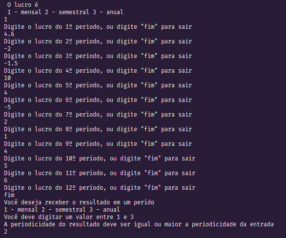

# Run away

## O que é o nosso projeto?

O nosso projeto é um organizador de tarefas para empresa, que identifica o minimo de funcionários necessários para realizar suas tarefas. Além disso organiza funcionários de forma eficiente.

## Membros:

| Nome                          | Github         | Matrícula  |
| ----------------------------- | -------------- | ---------- |
| Kathlyn Lara Murussi          | @klmurussi     | 18/0042378 |
| Júlio César Schneider Martins | @jschneiderm98 | 16/0032903 |

## Screenshots

### Exemplo de preenchimento a partir do terminal

### Resultado do exemplo de preenchimento a partir do terminal

### Preenchimento a partir do .txt, utilizando o exemplo `test1.txt`

## Vídeo da dupla

